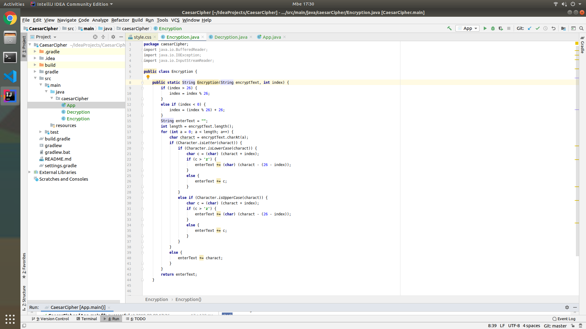
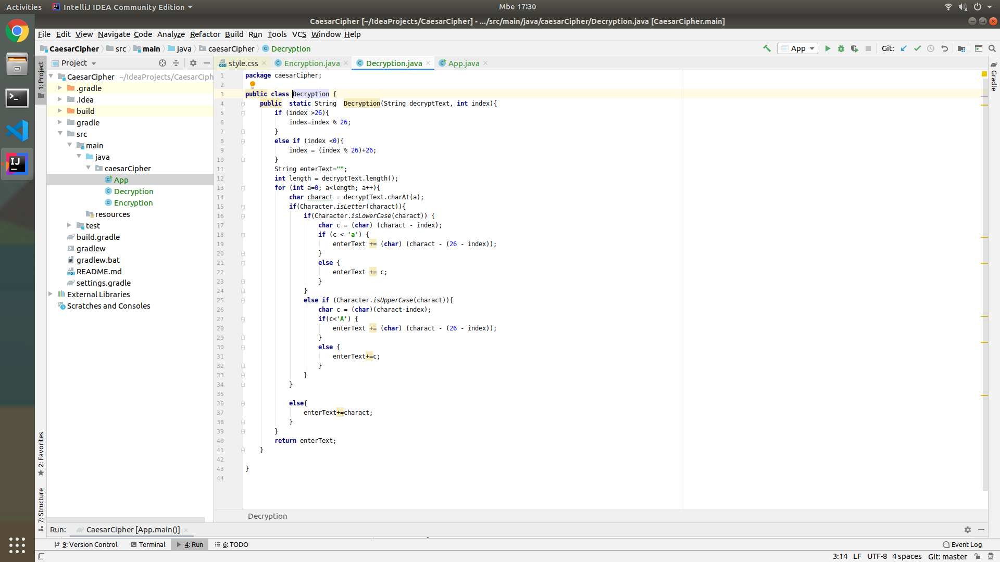
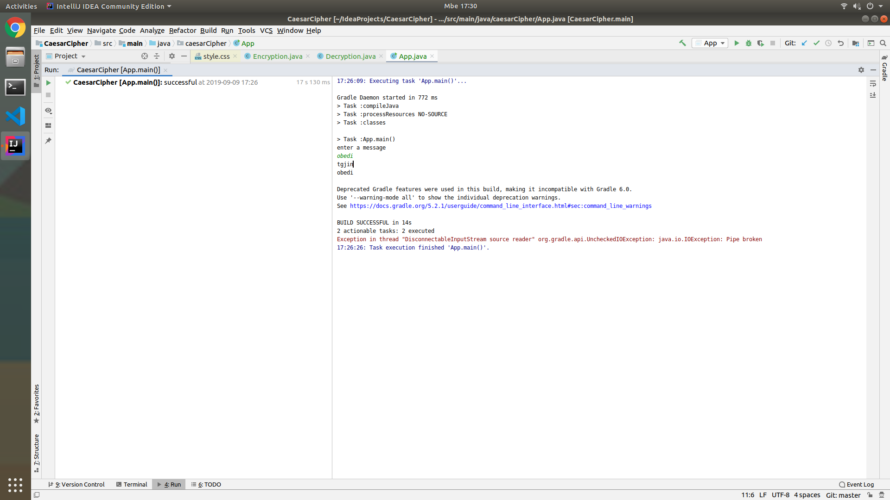

## CaesarCipher

## AUTHOR

kimbagira sylvie

## DESCRIPTION

you have to enter any test and lick to your choosen button ,after that you will get the output you asked for

## SETUP/REQUIREMENTS

you should clone to get my code

## BDD

behaviour

*go to the application, enter your text.

input

*any text

output

*an encrypted text
*a descripted text

## screenshot

>>>>>>> 4f820199606f7a298d394b738e436bf4331005eb
## LINK OF MY REPOSITORY

https://github.com/kimbagira/CaesarCipher

## BUGS
  no bugs
## TECHNOLOGIES USED

*HTML
*CSS
*JAVA

## LICENCE

copyright(c)2019 kimbagira sylvie
